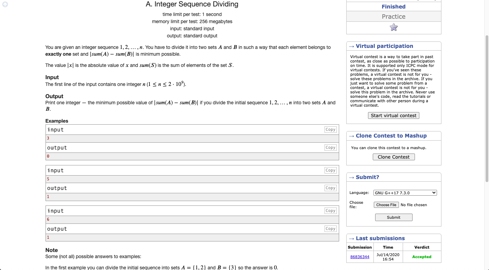

# Codeforces-1102A-Integer-Sequence-Dividing
### Problem

### Program Simulation
<pre>
  Sample Input: 3
 
  tmp = 3 * (3 + 1)
  tmp = 12
  tmp /= 2
  tmp = 6
  
  tmp % 2
  tmp = 0
  
  print tmp
  
  Final Output:
  0
  

  Sample Input: 5
  
  tmp = 5 * (5 + 1)
  tmp = 30
  tmp /= 2
  tmp = 15
  
  tmp % 2
  tmp = 1
  
  print tmp
  
  Final Output:
  1
  

  Sample Input: 6
  
  tmp = 6 * (6 + 1)
  tmp = 42
  tmp /= 2
  tmp = 21
  
  tmp % 2
  tmp = 1
  
  print tmp
  
  Final Output:
  1
</pre>
  
